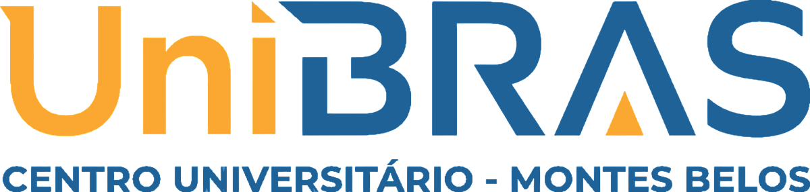

  

---

## 📌 Magia & Aço

---

## 👥 Equipe de Autores e Participantes

### 👥 Alunos

* [Integrante 1](https://github.com/KahuaOliveira) Kahuã Oliveira 
* [Integrante 2](https://github.com/retakezz) Jonas Evangelista 

### 📄 Identificação

* Disciplina: Ex.: Programaçao Orientada à Objetos, Fundamentos de Bancos de Dados
* Professor(a): Guilherme Nogueira

### ⚡️ Arquitetura e Stack Utilizado

* **Linguagem de Programação:** Ex.: Python, SQL
* **Banco de Dados: MySQL

## 📋 Licença e Atribuições

[Modelo GIT UNIBRAS](https://github.com/yggdrasilGit/templatesUNIBRAS) por [UNIBRAS](https://sejaunibras.com.br) está licenciado sob [CC BY 4.0 International](http://creativecommons.org/licenses/by/4.0/?ref=chooser-v1).
